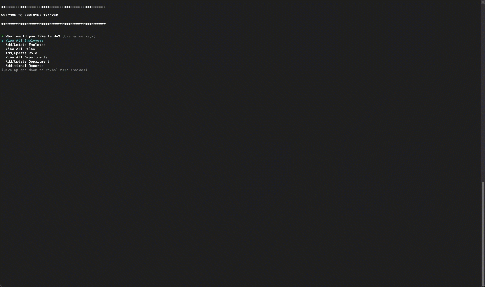
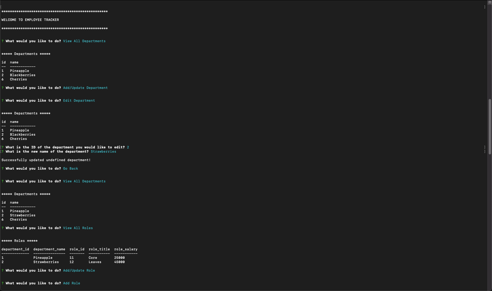

# employee-tracker

## Table of Contents

1. [Description](#description)
1. [Usage](#usage)
1. [User Story](#user-story)
1. [Acceptance Criteria](#acceptance-criteria)
1. [Licenses](#licenses)
1. [Technology](#technology)
1. [Mock-up](#mock-up)
1. [Support](#support)
   - [Installation](#installation)
   - [Questions](#questions)

## Description
A command-line application to manage a company's employee database.

## Usage
You can access the app here: [https://github.com/avidrunner87/employee-tracker](https://github.com/avidrunner87/employee-tracker).

## User Story
>**AS A(N)** business owner<br>
I **WANT** to be able to view and manage the departments, roles, and employees in my company<br>
**SO THAT** I can organize and plan my business


## Acceptance Criteria
**GIVEN** a command-line application that accepts user input

>**WHEN** I start the application<br>
**THEN** I am presented with the following options: view all departments, view all roles, view all employees, add a department, add a role, add an employee, and update an employee role

>**WHEN** I choose to view all departments<br>
**THEN** I am presented with a formatted table showing department names and department ids

>**WHEN** I choose to view all roles<br>
**THEN** I am presented with the job title, role id, the department that role belongs to, and the salary for that role

>**WHEN** I choose to view all employees<br>
**THEN** I am presented with a formatted table showing employee data, including employee ids, first names, last names, job titles, departments, salaries, and managers that the employees report to

>**WHEN** I choose to add a department<br>
**THEN** I am prompted to enter the name of the department and that department is added to the database

>**WHEN** I choose to add a role<br>
**THEN** I am prompted to enter the name, salary, and department for the role and that role is added to the database

>**WHEN** I choose to add an employee<br>
**THEN** I am prompted to enter the employee’s first name, last name, role, and manager, and that employee is added to the database

>**WHEN** I choose to update an employee role<br>
**THEN** I am prompted to select an employee to update and their new role and this information is updated in the database 


## Licenses
[](https://github.com/avidrunner87/employee-tracker/blob/main/LICENSE.md)

## Technology


## Mock-up
The following picture shows the website appearance and capabilities:

<br>


We also have a video that walks you through the entire application:

[Access Video](https://github.com/avidrunner87/employee-tracker/blob/main/assets/images/screenshots/walkthrough.mp4)
## Support
### Installation
To fork this code to further improve the website, please follow these directions:

1. In Github fork the repository.
1. Clone the repository to your local computer.

      _This assumes that you have setup your own SSH keys to connect with Github._

3. Before running the employee tracker app, please ensure all the necessary node modules are installed:

      ```
      npm install
      ```

4. You will also need to setup your initial database for the application.

   - Log into your local mysql instance

   - Source the schema.sql file located in the db folder

5. Copy and update contents of the .env.example file to reflect your local computer

      ```
      cp .env.example .env
      ```

You can run the application using the following command:
      
```
npm start
```

### Questions
If you have any questions please reach out to me via [Github](https://github.com/avidrunner87) or via [email](mailto:andrew.ronchetto@me.com).